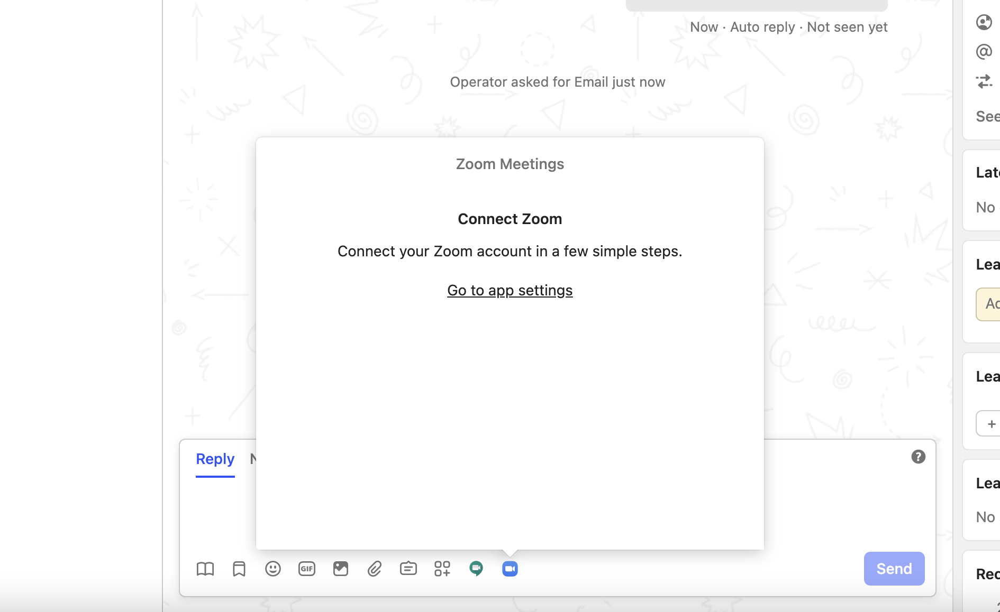
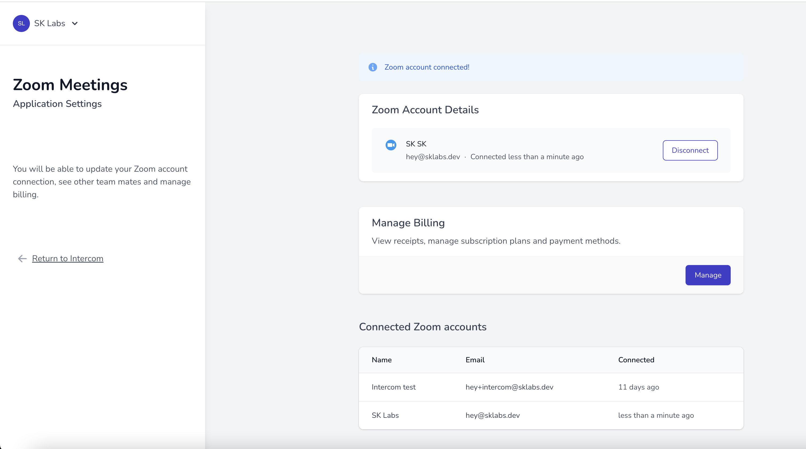
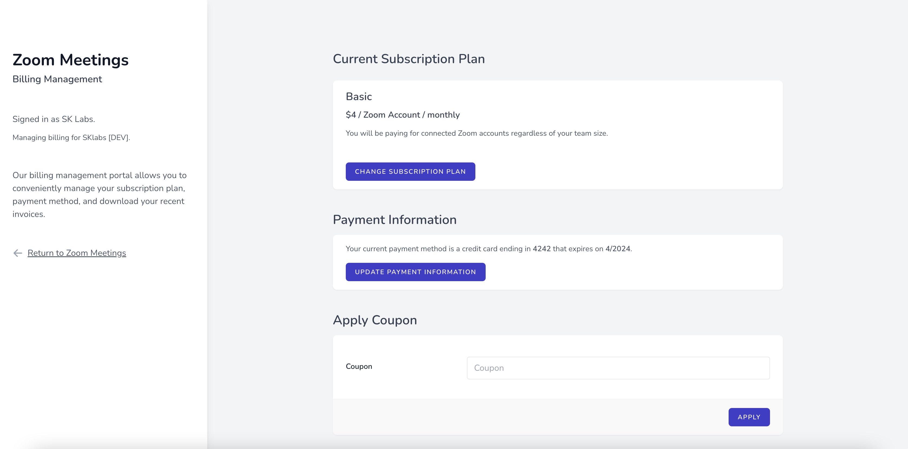
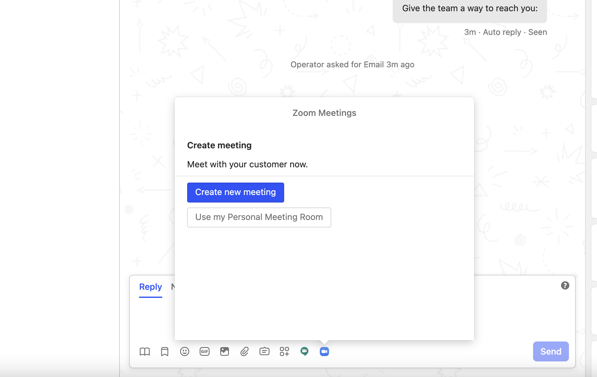
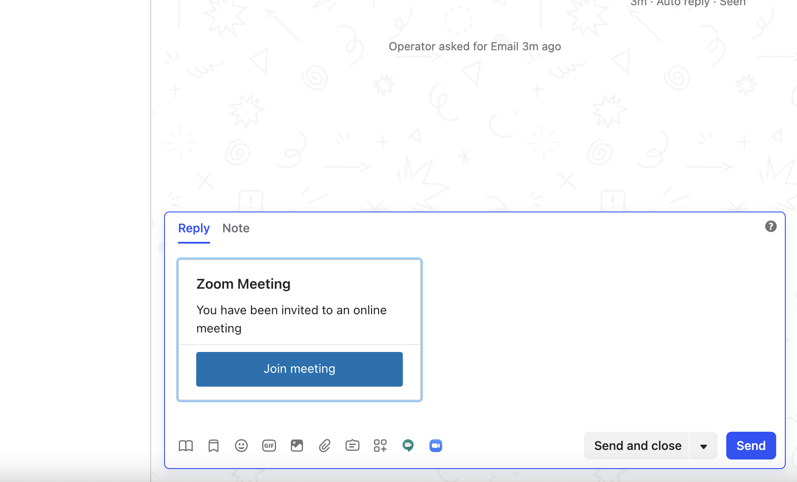
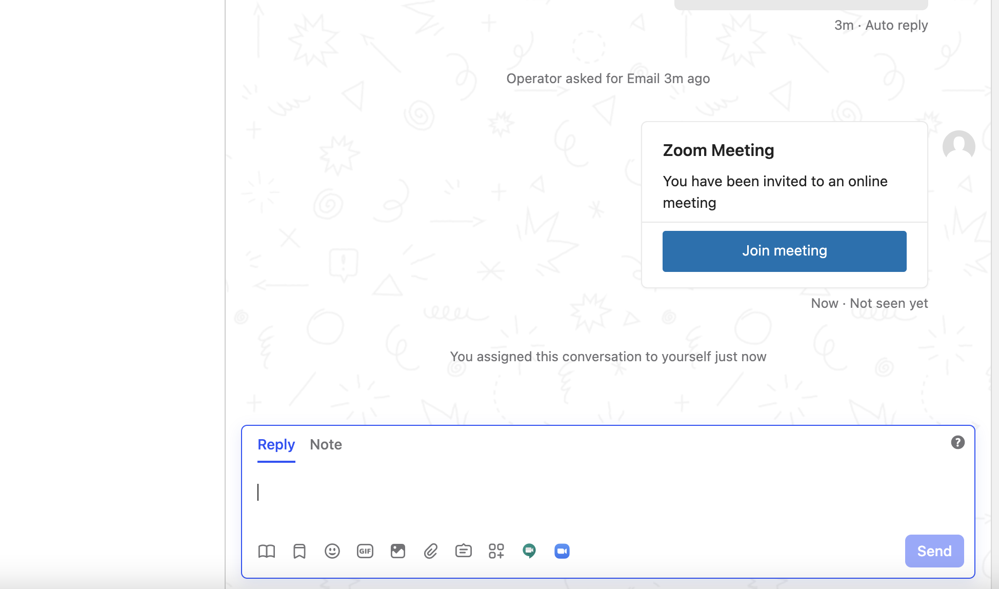
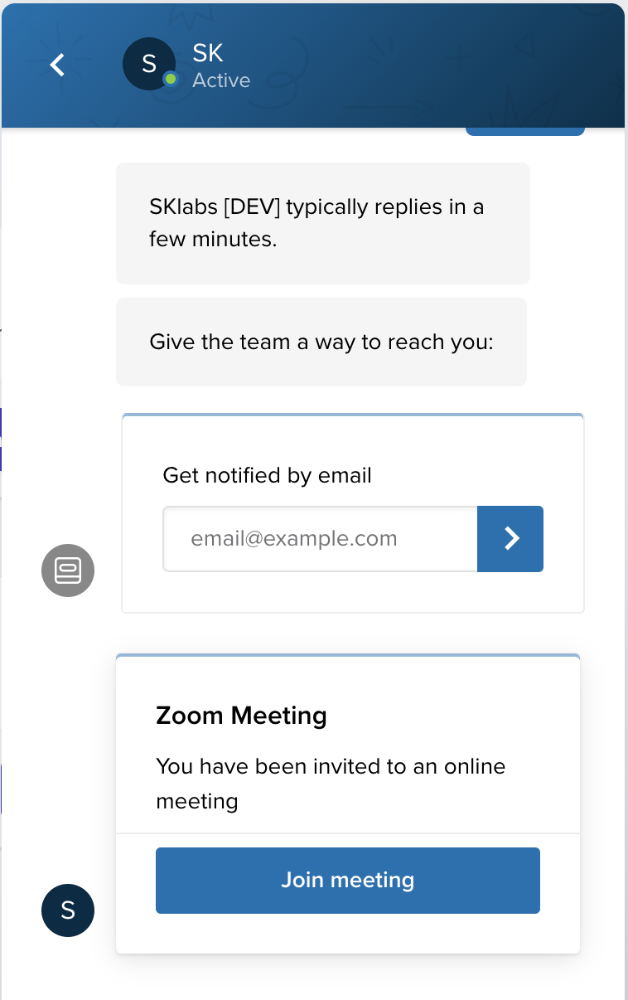

# Zoom Meetings

## Prerequisite

The app requires you to have **Zoom account** which can be created [here](https://zoom.us/signup).

## Initial setup

1. Install the Zoom Meetings app from the [Intercom App Store](https://app.intercom.com/a/apps/q0amzsrn/appstore?app_package_code=zoom-meetings).
2. From the Inbox Conversation section select the **Zoom Meetings** app icon:

3. Click on **Go to app settings** and connect your Zoom account:

4. Once connected, you can select your subscription type:

## Starting a meeting

To invite your customer to join a video meeting just click the Create new meeting button or Use my Personal Meeting Room:

Once you have clicked send, a meeting will be created and the invitation will be sent to your customer:

## Joining the meeting

Your customers now can join the meeting by clicking on Join meeting.

## Removing the app

1. Log in to your Zoom account and navigate to the Zoom App Marketplace.
2. Click **Manage > Added Apps**.
3. Click on the **Remove** button.

## Feedback and feature request

You can send us your feedback and feature request at [support@sklabs.dev](mailto:support@sklabs.dev).
