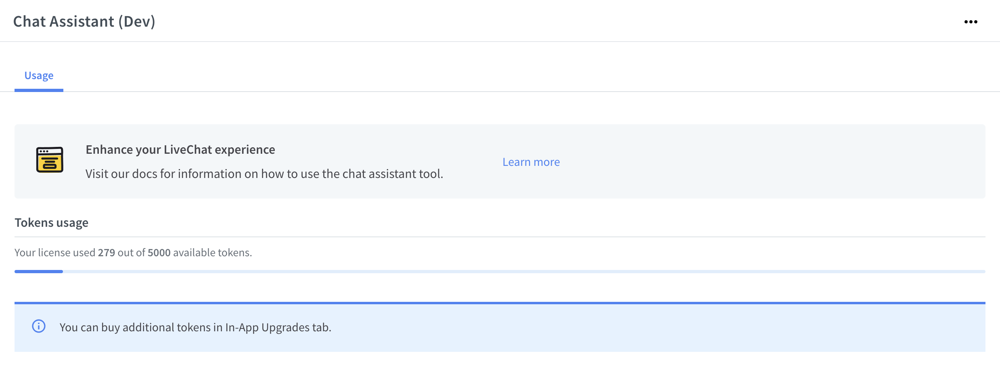
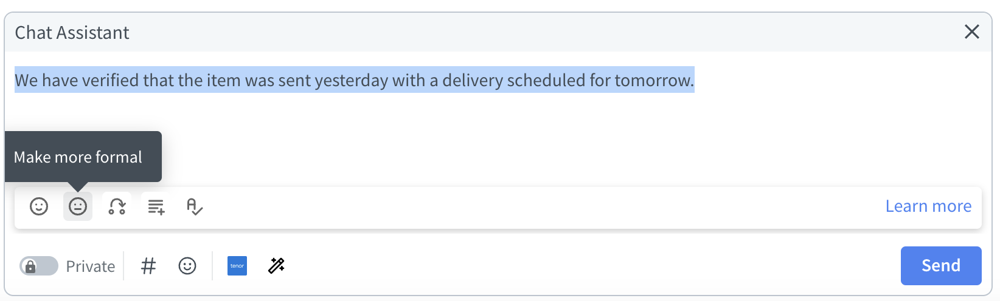
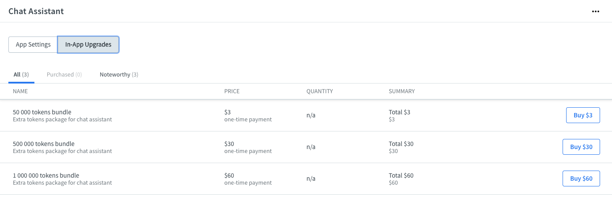

# Chat Assistant

## Introduction

Welcome to the documentation for our AI-powered LiveChat support app! Our app is designed to enhance the customer service experience and make LiveChat support more efficient and effective. This documentation will provide you with a comprehensive guide on how to use our app's various features and tools, including AI-powered text expansion, personalized message tone, grammar correction, real-time assistance, and customizable keyboard shortcuts. With this information, you'll be able to use our app to its full potential and provide your customers with the best possible service. Let's get started!

## Initial setup

1. Install the app from <a href="https://www.livechat.com/marketplace/apps/chat-assistant" target="_blank">the LiveChat Marketplace</a>
2. In the LiveChat Agent Application, go to **Settings > Manage apps > Chat Assistant**.
3. Authorize the application.
4. For start you will get **5k** [tokens](#tokens) completely **free** from us!
5. Your app is ready to go!



## Tokens

In this AI-powered LiveChat support app, OpenAI is used to provide features such as text expansion, personalized message tone, grammar correction, real-time assistance, and customizable keyboard shortcuts. This is achieved through tokenization, which is the process of breaking down input text into smaller units, called tokens, that the AI model can understand and generate text based on. These tokens are then processed by the model to generate meaningful responses, making the LiveChat support more efficient and effective.

You can think of tokens as pieces of words, where 1,000 tokens is about 750 words.

## Usage and examples

### Make more friendly

This feature adjusts the tone of the generated response to be more conversational and approachable.

### Make more formal

This feature adjusts the tone of the generated response to be more professional and formal.

### Rephrase

This feature generates alternative phrasing for a given input, allowing for greater clarity and customization of responses.

### Expand

This feature uses AI to generate additional text based on a given input, allowing for more comprehensive and detailed responses.

### Fix grammar

This feature uses AI to identify and correct grammatical errors in generated responses, ensuring the output is clear and accurate.



### Examples

```
Before: hi, please provide your account details
Make more friendly: Hello there! Could you please provide me with your account information so I can better assist you?
```

- Token count: 51

```
Before: hi, please provide your account details
Make more formal: Good day! Could you please provide your account information so that we can further assist you?
```

- Token count: 54

```
Before: hi, please provide your account details
Rephrase: Hello there! Could you please kindly provide us with your account information so we can help you further?
```

- Token count: 55

```
Before: hi, please provide your account details
Expand: Hi there! Thank you for reaching out with your issue. In order to help you further, I will need some additional information from you. Can you please provide me with your account details so that I can take a closer look? Thank you!
```

- Token count: 89

```
Before: hi, please provide your account details
Fix grammar: Hi, please provide your account details.
```

- Token count: 32

## Pricing

The app is free to use, and with the initial installation, you will receive 5k tokens. Chat inputs vary in length, so it's hard to calculate the average usage for your account. However, that amount of tokens should give you and your team a nice overview of the app.

When your tokens will expire, you can top-up your account using In-App Upgrades from the Settings section. We will also send you an email reminding you that your tokens are about to expire.



## Privacy

At **SKLabs**, we use **OpenAI** to power some of our products and services, but it's important to note that **OpenAI** does not have the ability to access, store, or share user data. All data processed by **OpenAI** is used solely for the purpose of generating responses to user queries and is immediately discarded after use. This means that any information you share with us remains under our control and is subject to our privacy policy.

Our privacy policy outlines the types of information we collect, how it is used, and with whom it may be shared. We will not sell or rent your personal information to third parties and will only use it to provide and improve our products and services, or as otherwise required by law.

In addition, we use industry-standard encryption protocols and have implemented strict access controls to ensure the security of your data. We regularly review and update our privacy and security measures to ensure that we are in compliance with applicable laws and regulations, and that we are providing our users with the best possible protection.

If you have any questions or concerns about our privacy policy, please don't hesitate to reach out to us. Our support team is always here to help and will be happy to address any concerns you may have.

## Feedback and feature request

You can send us your feedback and feature requests at [support@sklabs.dev](mailto:support@sklabs.dev).
