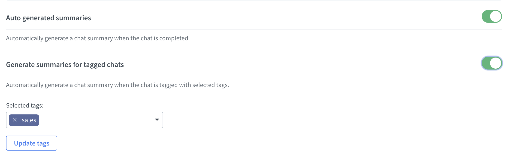
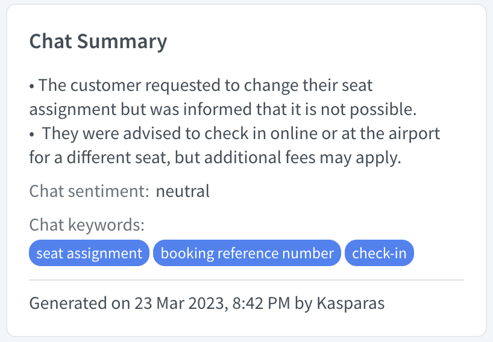

# Chat Summary

## Introduction

Welcome to the documentation for our LiveChat summary generation app, which allows you to easily generate summaries from your LiveChat transcripts, making it simpler to review and understand the key points of your chats. Utilizing the power of OpenAI's cutting-edge natural language processing technology through the API, our app is able to generate accurate summaries and stay up-to-date with the latest advancements in this field.

<iframe frameborder="0" scrolling="no" marginheight="0" marginwidth="0" width="800" height="480" type="text/html" src="https://www.youtube.com/embed/N36hBPeTp18?autoplay=1&fs=0&iv_load_policy=3&showinfo=0&rel=0&cc_load_policy=0&start=0&end=0"></iframe>

## Initial setup

1. Install the app from <a href="https://www.livechat.com/marketplace/apps/chat-summary" target="_blank">the LiveChat Marketplace</a>
2. In the LiveChat Agent Application, go to **Settings > Manage apps > Chat Summary**.
3. Authorize the application.
4. Your app is ready to go!


## Settings

- Auto generate summaries

By default, the summary is auto-generated when a chat is archived, and it's available from the Details section or within the app itself. You can always change this setting to disable it, and then manually generate the summary from the Chats or Archives section within the Details panel by clicking 'Generate Summary'.

- Generate summaries for tagged chats

You can specify tags that are required for auto-generation. Multiple tags can be selected. Please note, this option only works when the auto-generation setting is enabled. Tagging needs to occur while the chat is active.



## Reports

From the Settings section, you can check the report of already generated summaries, which includes chat details, usage of tokens, and the date. The report is exportable to a CSV file.


## Examples

This is an example of real chat between agent and customer:

```
Agent: Hello. How may I help you?

Visitor: Hi there! I'm having some trouble with my account. I'm not able to log in.

Agent: I'm sorry to hear that. Can you provide me with your username or email address associated with the account so I can take a look?

Visitor: Sure, it's info@test.com.

Agent: Thank you for the information. I'm seeing that your account has been locked due to multiple failed login attempts. I can unlock it for you, but for security reasons, I will need to verify your identity. Can you provide me with your full name and the last four digits of the credit card on file for the account?

Visitor: My name is John Smith and the last four digits of the credit card are 1234.

Agent: Thank you, Mr. Smith. I have successfully unlocked your account. You should now be able to log in. If you have any other issues, don't hesitate to reach out to us.

Visitor: Thank you so much for your help!
```

Summary generated:

```
- Visitor is having trouble logging into their account
- Agent needs to verify identity to unlock account
- Visitor provides name and last four digits of credit card
- Account is successfully unlocked
```

## Widget

The Chat Summary app creates a widget in the LiveChat interface that allows you to quickly generate summaries from your transcripts.


You can also find a detailed summary in the Details section of each chat for a quick overview of the key points discussed.



## Chat sentiment

In addition to generating summaries from your LiveChat transcripts, the Chat Summary app can also analyze the sentiment of each chat. By using natural language processing technology, the app is able to determine whether a chat is **neutral**, **positive**, or **negative** in tone. This information can be incredibly valuable for understanding the overall sentiment of your customer interactions, and for identifying areas where your team may need additional training or support. With this feature, you can quickly gain insights into the sentiment of your chats without having to manually review each transcript, saving you time and effort in the process.

## Keywords

In addition to generating summaries and analyzing chat sentiment, the Chat Summary app also has the ability to generate three keywords that describe the content of each chat transcript. This feature uses advanced natural language processing techniques to analyze the chat and identify the most relevant keywords. These keywords can be incredibly useful for quickly understanding the main topics or themes of each conversation, and for identifying patterns or trends in your customer interactions. By providing this feature, the Chat Summary app enables you to gain valuable insights into the content of your chats in a fraction of the time it would take to review them manually.

## Privacy

At **SKLabs**, we use **OpenAI** to power some of our products and services, but it's important to note that **OpenAI** does not have the ability to access, store, or share user data. All data processed by **OpenAI** is used solely for the purpose of generating responses to user queries and is immediately discarded after use. This means that any information you share with us remains under our control and is subject to our privacy policy.

Our privacy policy outlines the types of information we collect, how it is used, and with whom it may be shared. We will not sell or rent your personal information to third parties and will only use it to provide and improve our products and services, or as otherwise required by law.

In addition, we use industry-standard encryption protocols and have implemented strict access controls to ensure the security of your data. We regularly review and update our privacy and security measures to ensure that we are in compliance with applicable laws and regulations, and that we are providing our users with the best possible protection.

If you have any questions or concerns about our privacy policy, please don't hesitate to reach out to us. Our support team is always here to help and will be happy to address any concerns you may have.

## Feedback and feature request

You can send us your feedback and feature requests at [support@sklabs.dev](mailto:support@sklabs.dev).
