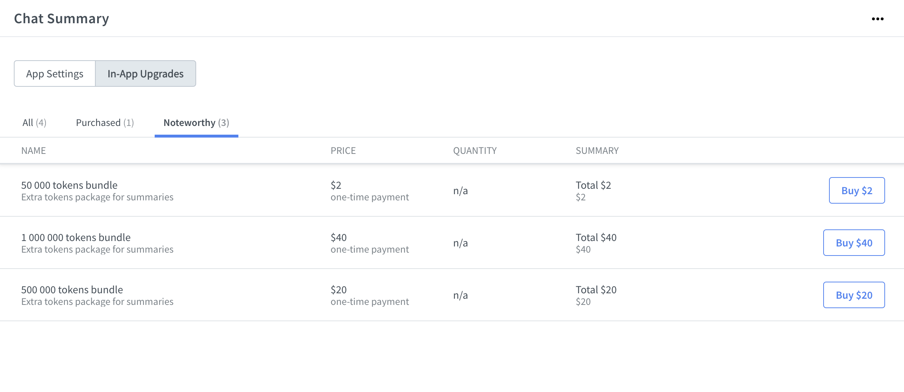
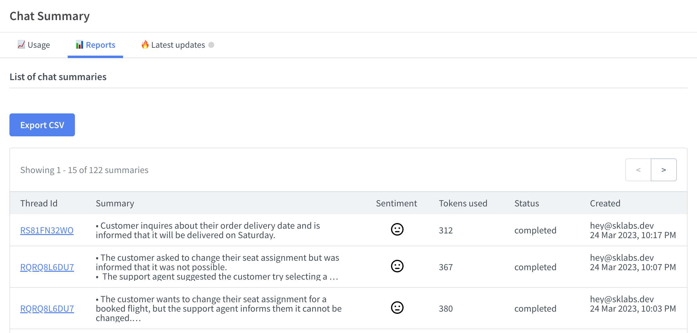

# Chat Summary

## Introduction

Welcome to the documentation for our LiveChat summary generation app, which allows you to easily generate summaries from your LiveChat transcripts, making it simpler to review and understand the key points of your chats. Utilizing the power of OpenAI's cutting-edge natural language processing technology through the API, our app is able to generate accurate summaries and stay up-to-date with the latest advancements in this field.

<iframe frameborder="0" scrolling="no" marginheight="0" marginwidth="0" width="800" height="480" type="text/html" src="https://www.youtube.com/embed/N36hBPeTp18?autoplay=1&fs=0&iv_load_policy=3&showinfo=0&rel=0&cc_load_policy=0&start=0&end=0"></iframe>

## Initial setup

1. Install the app from <a href="https://www.livechat.com/marketplace/apps/chat-summary" target="_blank">the LiveChat Marketplace</a>
2. In the LiveChat Agent Application, go to **Settings > Manage apps > Chat Summary**.
3. Authorize the application.
4. For start you will get **200k** [tokens](#tokens) completely **free** from us!
5. Your app is ready to go!


## Tokens

OpenAI's natural language processing technology uses a process called tokenization to break down chat transcripts into individual units of meaning, called tokens. These tokens are then analyzed and used to generate summary bullet points. The number of tokens used in the summary can be adjusted to fit the desired length and level of detail of the summary.

You can think of tokens as pieces of words, where 1,000 tokens is about 750 words.

Here are a few examples of chat transcripts and the estimated number of tokens needed to accurately summarize them:

```
Customer: Hi, can I get a refund?
Agent: Sure, I can process that for you.
Customer: Great, thank you.
```

- Characters: 103
- Token count: 30

```
Customer: Hi, I have a question about my order.
Agent: Sure, what's your order number?
Customer: It's 123456.
Agent: Let me check that for you.
Customer: I also want to know if I can get a different color.
Agent: Sure, we can arrange that for you.
Customer: Thanks, that would be great.
```

- Characters: 286
- Token count: 79

As you can see, in the first example, the conversation was short and simple, requiring only 30 tokens to accurately summarize the main points. In the second example, the conversation was longer and more complex, requiring 79 tokens to fully capture the key points.

Additionally to the transcript tokens are also used to the bullet points summary.

## Pricing

The app is free to use, and with the initial installation, you will receive 200k tokens. Chat transcripts vary in length, so it's hard to calculate the average usage for your account. However, that amount of tokens should give you and your team a nice overview of the app.

When your tokens will expire, you can top-up your account using In-App Upgrades from the Settings section. We will also send you an email reminding you that your tokens are about to expire.



## Settings

By default, the summary is auto-generated when a chat is archived and it's available from the Details section or the app itself. You can always change that setting and disable it, and then manually generate it from the Chats or Archives section from the Details panel by clicking Generate Summary.

## Reports

From the Settings section, you can check the report of already generated summaries, which includes chat details, usage of tokens, and the date. The report is exportable to a CSV file.



## Examples

This is an example of real chat between agent and customer:

```
Agent: Hello. How may I help you?

Visitor: Hi there! I'm having some trouble with my account. I'm not able to log in.

Agent: I'm sorry to hear that. Can you provide me with your username or email address associated with the account so I can take a look?

Visitor: Sure, it's info@test.com.

Agent: Thank you for the information. I'm seeing that your account has been locked due to multiple failed login attempts. I can unlock it for you, but for security reasons, I will need to verify your identity. Can you provide me with your full name and the last four digits of the credit card on file for the account?

Visitor: My name is John Smith and the last four digits of the credit card are 1234.

Agent: Thank you, Mr. Smith. I have successfully unlocked your account. You should now be able to log in. If you have any other issues, don't hesitate to reach out to us.

Visitor: Thank you so much for your help!
```

Summary generated:

```
- Visitor is having trouble logging into their account
- Agent needs to verify identity to unlock account
- Visitor provides name and last four digits of credit card
- Account is successfully unlocked
```

- Token count: 279


## Privacy

At **SKLabs**, we use **OpenAI** to power some of our products and services, but it's important to note that **OpenAI** does not have the ability to access, store, or share user data. All data processed by **OpenAI** is used solely for the purpose of generating responses to user queries and is immediately discarded after use. This means that any information you share with us remains under our control and is subject to our privacy policy.

Our privacy policy outlines the types of information we collect, how it is used, and with whom it may be shared. We will not sell or rent your personal information to third parties and will only use it to provide and improve our products and services, or as otherwise required by law.

In addition, we use industry-standard encryption protocols and have implemented strict access controls to ensure the security of your data. We regularly review and update our privacy and security measures to ensure that we are in compliance with applicable laws and regulations, and that we are providing our users with the best possible protection.

If you have any questions or concerns about our privacy policy, please don't hesitate to reach out to us. Our support team is always here to help and will be happy to address any concerns you may have.

## Feedback and feature request

You can send us your feedback and feature requests at [support@sklabs.dev](mailto:support@sklabs.dev).
