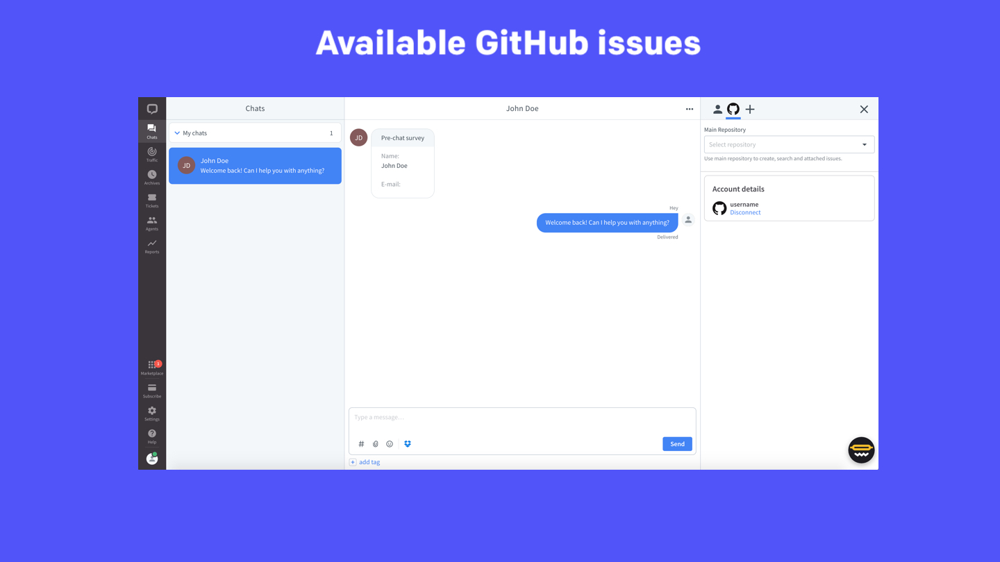
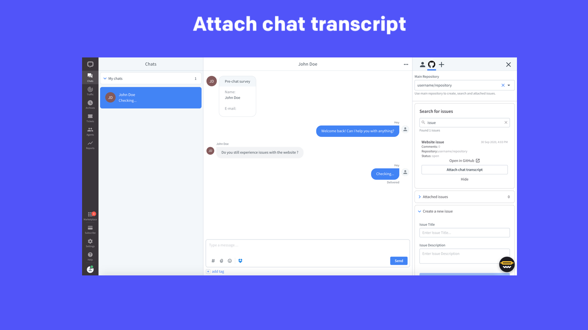
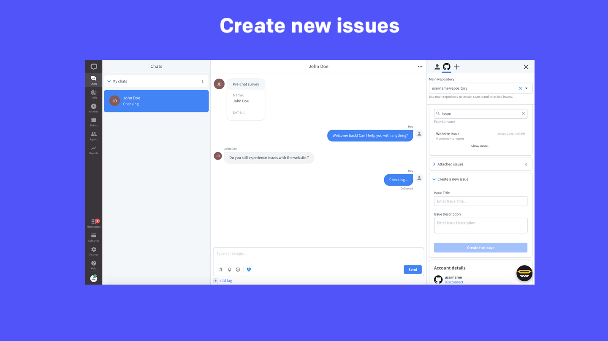

# GitHub for LiveChat

## Initial setup

1. Install the app from the LiveChat Marketplace.
2. Log in to the GitHub account you'd like to integrate with LiveChat.
3. Authorize GitHub for LiveChat by clicking **Allow**.

## Main GitHub repository

You have to choose your **main GitHub repository** from the select box. You will be able to search, view and create new issues within this repository.

## Searching issues

You can search for issues that already exist on your **main GitHub repository**. To do that, start typing the search phrase.
For each issue, the app displays the issue title, its creation date, as well as the status.

## Viewing attached issues

As an agent, you have access to the issues assigned to a customer account. You can find them in the **Attached issue** section. View them in the Agent Application or open them in **main GitHub repository** with just one click.

## Attaching chat transcript

Add chat transcripts to the issue assigned to your customer account. To do that, go to **Attached issues** and click **Attach chat transcript**.

You can also add chat transcripts to the issues that are unassigned. To achieve that, search for an issue, select it, and click **Attach chat transcript**. By doing that, the issue will be automatically assigned to your customer account.

## Creating new issue

Go to **Create an new issue** and fill out the short form. Give it a title and description, and confirm the operation by clicking **Create the issue**. The issue is going to be create on the **main GitHub repository**.

## Feedback and feature request

You can send us your feedback and feature request at [hey@sklabs.dev](mailto:hey@sklabs.dev).
