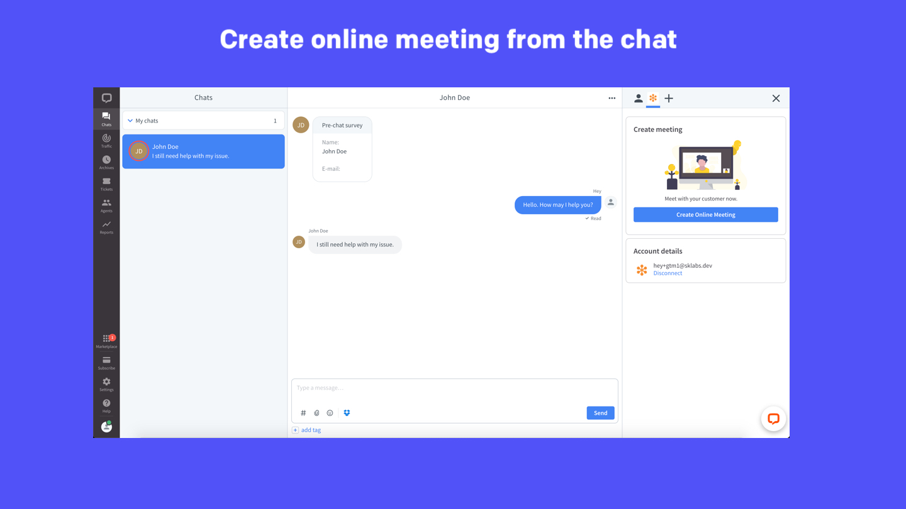
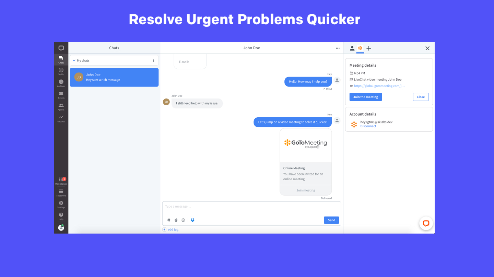

# GoToMeeting for LiveChat

## Prerequisite

The app requires you to have **GoToMeeting account** which can be created [here](https://www.gotomeeting.com/try).

## Initial setup

1. Install the app from the [LiveChat Marketplace](https://www.livechat.com/marketplace/apps/gotomeeting-for-livechat/).
2. You can simply invite customers to join a video meeting while you’re chatting to them. Just click the app icon in the Agent App Widget section, choose the **GoToMeeting for LiveChat** app and **Connect:**
3. Authorize **GoToMeeting for LiveChat**.
4. Once connected, you can start inviting your customers to join video meetings with you.

## Starting a meeting

To invite your customer to join a video meeting just click the **Create online meeting** button:

Once clicked, a meeting will be created and the invitation will be send to your customer:

## Join the meeting

You can now join the meeting by clicking on **Join meeting** from your app.

## Uninstalling the app from LiveChat

1. Open the LiveChat App https://my.livechatinc.com/.
2. Go to **Settings >> Integrations & apps >> Installed Apps**.
3. Find the **GoToMeeting for LiveChat** app and click on **Actions >> Uninstall**.
4. Click on **Submit and uninstall**.

## Feedback and feature request

You can send us your feedback and feature request at [hey@sklabs.dev](mailto:hey@sklabs.dev).
