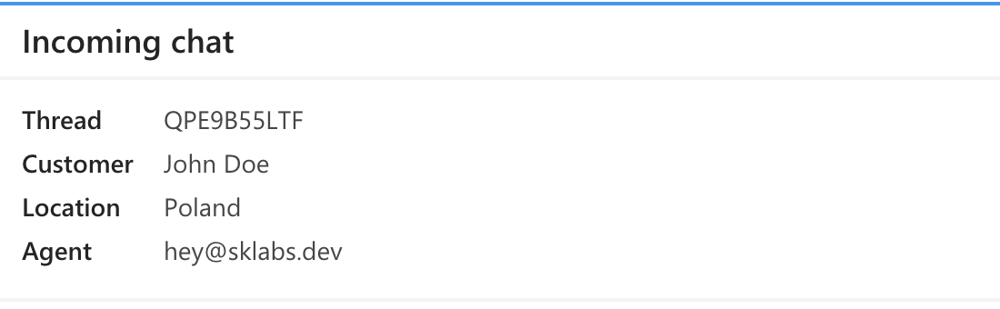
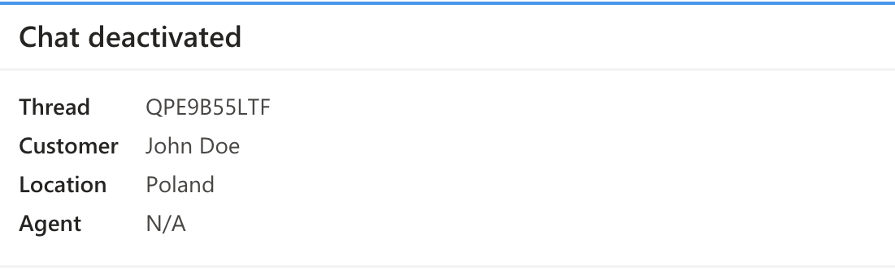
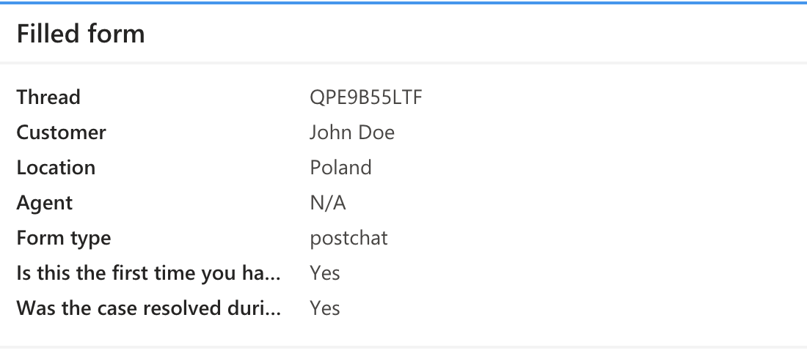
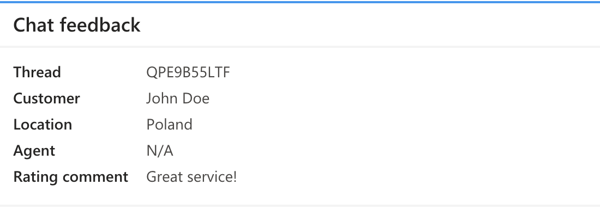

# Microsoft Teams

## Prerequisites

[Microsoft Teams](https://www.microsoft.com/en-us/microsoft-teams/group-chat-software) account is required.

## Initial setup

1. Install the app from [the LiveChat Marketplace](https://www.livechat.com/marketplace/apps/microsoft-teams).
2. In the LiveChat Agent Application, go to **Settings > Integrations & apps > Microsoft Teams**.
3. Authorize the application.

## Configure notifications

1. Click **Add Microsoft Teams notification**.
2. Select **the LiveChat group** from which you want to receive notifications. If you want to receive notifications from more than one group, repeat the configuration for each group.
3. Enter the **webhook URL** that will receive the notifications. If you don't know how to get such a URL, [read a tutorial](https://docs.microsoft.com/en-us/microsoftteams/platform/webhooks-and-connectors/how-to/add-incoming-webhook#add-an-incoming-webhook-to-a-teams-channel) in the Microsoft Teams documentation.
4. Select what events should trigger sending notifications.
5. **Save** changes. You should now see Microsoft Teams on the list of notifications.

💡 Use the **Status** toggle to enable notifications. If you want to edit the configuration or delete the notifications, use the three-dot menu.

### Example

- **Incoming chat**

  

- **Chat deactivated**

  

- **Pre-chat/Post-chat survey filled**

  

- **Chat was rated by customer**

  

- **Chat was commented by Customer**

  

## Feedback and feature request

You can send us your feedback and feature requests at [hey@sklabs.dev](mailto:hey@sklabs.dev).
