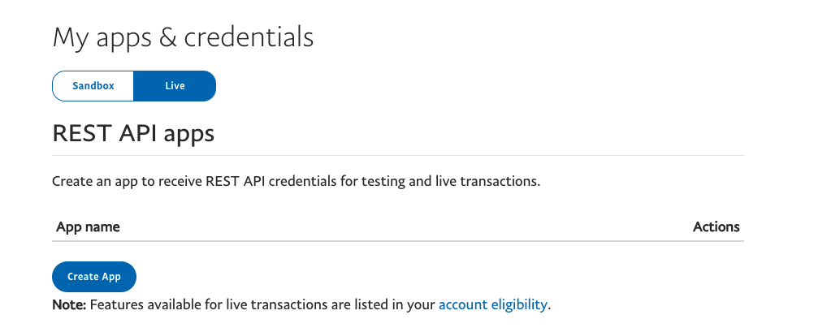
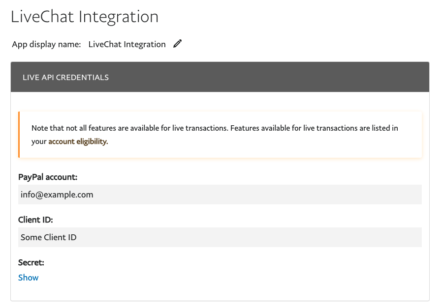
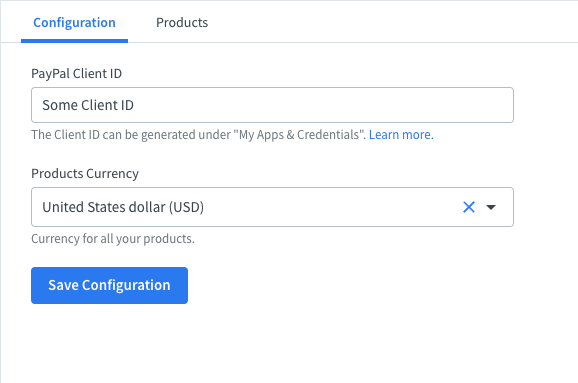

# PayPal

## Prerequisites

<a href="https://www.paypal.com" target="_blank">PayPal</a>
account is required.

## Initial setup

1. Install the app from <a href="https://www.livechat.com/marketplace/apps/paypal" target="_blank">the LiveChat Marketplace</a>
2. In the LiveChat Agent Application, go to **Settings > Manage apps > PayPal**.
3. Authorize the application.

## Configure PayPal account

1. Go to <a href="https://developer.paypal.com/developer/applications" target="_blank">PayPal Developer Dashboard</a> and click on `Log in to Dashboard` with your PayPal business credentials.

2. Go to `My Apps & Credentials` section on the left sidebar.

3. Select `Live` option and click on `Create App` button.
   

4. Type the **App Name** e.g. `LiveChat Integration` and click on `Create App`.
   

5. Copy the **Client ID** and paste it in the `Settings` section in the LiveChat App.
   

## Feedback and feature request

You can send us your feedback and feature requests at [hey@sklabs.dev](mailto:hey@sklabs.dev).
