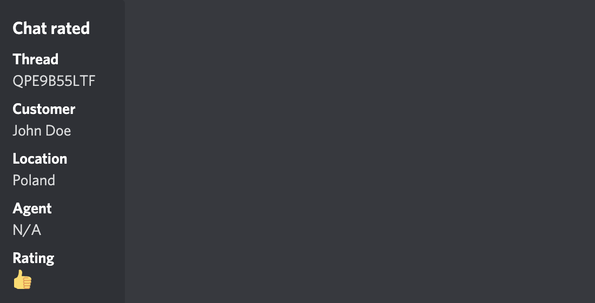
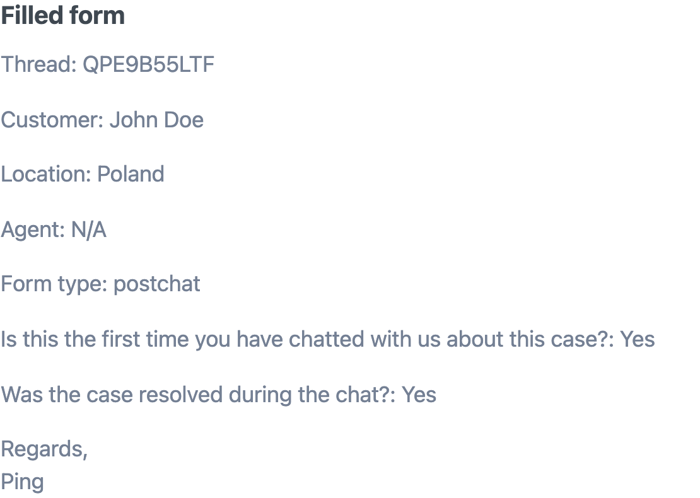
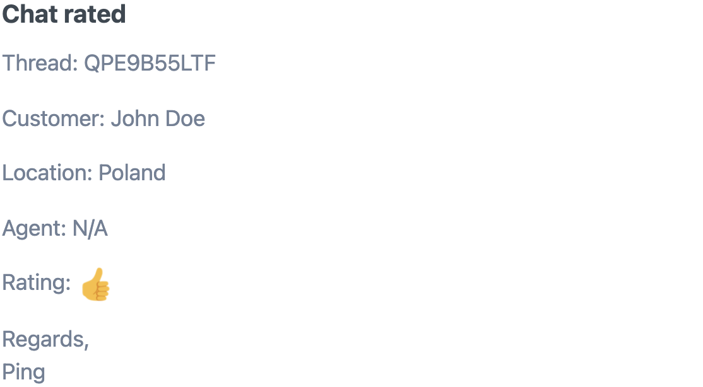

# Ping

## Prerequisites

Depending on which channels you want to configure, you'll be connecting Ping with your [Slack](https://slack.com/) workspace, [Microsoft Teams](https://www.microsoft.com/en/microsoft-teams/log-in) account, and your [Discord](https://discord.com/) server.

For email and SMS notifications, you can use whatever address and phone number you want.

## Initial setup

1. Install the app from [the LiveChat Marketplace](https://www.livechat.com/marketplace/apps/ping).
2. In the LiveChat Agent Application, go to **Settings > Integrations & apps > Ping**.
3. Authorize the application.

## Configurations

- [Configuring Slack notifications](#configuring-slack-notifications)
- [Configuring Microsoft Teams notifications](#configuring-msteams-notifications)
- [Configuring Discord notifications](#configuring-discord-notifications)
- [Configuring Email notifications](#configuring-email-notifications)
- [Configuring SMS notifications](#configuring-sms-notifications)

### Configuring Slack notifications

1. Click **Add channel** and select **Slack** from the list of channels.
2. Select **the LiveChat group** from which you want to receive notifications. If you want to receive notifications from more than one group, repeat the configuration for each group.
3. Enter the **webhook URL** that will receive the notifications. If you don't know how to get such a URL, [read a tutorial](https://slack.com/intl/en-pl/help/articles/115005265063-Incoming-webhooks-for-Slack) in the Slack documentation.
4. Select what events should trigger sending notifications.
5. **Save** changes. You should now see Slack on the list of channels.

💡 Use the **Status** toggle to enable notifications. If you want to edit the configuration or delete the channel, use the three-dot menu.

#### Example

- **Incoming chat**

  

- **Chat deactivated**

  

- **Pre-chat/Post-chat survey filled**

  

- **Chat was rated by customer**

  

- **Chat was commented by Customer**

  

### Configuring Microsoft Teams notifications

1. Click **Add channel** and select **Microsoft Teams** from the list of channels.
2. Select **the LiveChat group** from which you want to receive notifications. If you want to receive notifications from more than one group, repeat the configuration for each group.
3. Enter the **webhook URL** that will receive the notifications. If you don't know how to get such a URL, [read a tutorial](https://docs.microsoft.com/en-us/microsoftteams/platform/webhooks-and-connectors/how-to/add-incoming-webhook#add-an-incoming-webhook-to-a-teams-channel) in the Microsoft Teams documentation.
4. Select what events should trigger sending notifications.
5. **Save** changes. You should now see Microsoft Teams on the list of channels.

💡 Use the **Status** toggle to enable notifications. If you want to edit the configuration or delete the channel, use the three-dot menu.

#### Example

- **Incoming chat**

  

- **Chat deactivated**

  

- **Pre-chat/Post-chat survey filled**

  

- **Chat was rated by customer**

  

- **Chat was commented by Customer**

  

### Configuring Discord notifications

1. Click **Add channel** and select **Discord** from the list of channels.
2. Select **the LiveChat group** from which you want to receive notifications. If you want to receive notifications from more than one group, repeat the configuration for each group.
3. Click the button to connect with Discord.
   - First, you'll be asked to log in.
   - Then, add the **SKLabs** bot to your Discord server, and authorize Ping.
4. Provide the **id** of the **channel** that will receive the notifications. If you don't know how to get it, Discord explains that in their [documentation](https://support.discord.com/hc/en-us/articles/206346498-Where-can-I-find-my-User-Server-Message-ID-).
5. Select what events should trigger sending notifications.
6. **Save** changes. You should now see Discord added to the list of channels.

💡 Use the **Status** toggle to enable notifications. If you want to edit the configuration or delete the channel, use the three-dot menu.

#### Example

- **Incoming chat**

  

- **Chat deactivated**

  

- **Pre-chat/Post-chat survey filled**

  

- **Chat was rated by customer**

  

- **Chat was commented by Customer**

  

### Configuring Email notifications

You start with a credit of **10** notifications. You can use it for both **email** and **SMS** notifications. If you need to extend the limit, you can activate more credits in the In-app upgrades tab. There are different packages available. Keep track of how many credits you've used in the **Account info** section.

The configuration for both free and paid credits remains the same:

1. Click **Add channel** and select **Email** from the list of channels.
2. Select **the LiveChat group** from which you want to receive notifications. If you want to receive notifications from more than one group, repeat the configuration for each group.
3. Enter the email address you want to send the notifications to. Repeat the configuration if you want to notify more than one email.
4. Select what events should trigger sending notifications.
5. **Save** changes. You should see Email on the list of channels.

💡 Use the **Status** toggle to enable notifications. If you want to edit the configuration or delete the channel, use the three-dot menu.

#### Example

- **Incoming chat**

  

- **Chat deactivated**

  

- **Pre-chat/Post-chat survey filled**

  

- **Chat was rated by customer**

  

- **Chat was commented by Customer**

  

### Configuring SMS notifications

You start with a credit of **10** notifications. You can use it for both **email** and **SMS** notifications. If you need to extend the limit, you can activate more credits in the In-app upgrades tab. There are different packages available. Keep track of how many credits you've used in the **Account info** section.

The configuration for both free and paid credits remains the same:

1. Click **Add channel** and select **SMS** from the list of channels.
2. Select **the LiveChat group** from which you want to receive notifications. If you want to receive notifications from more than one group, repeat the configuration for each group.
3. Enter the phone number address you want to send the notifications to. Repeat the configuration if you want to notify more than one number.
4. Select what events should trigger sending notifications.
5. **Save** changes. You should see SMS on the list of channels.

#### Example

- **Incoming chat**

  

- **Chat deactivated**

  

- **Pre-chat/Post-chat survey filled**

  

- **Chat was rated by customer**

  

- **Chat was commented by Customer**

  

## Feedback and feature request

You can send us your feedback and feature requests at [hey@sklabs.dev](mailto:hey@sklabs.dev).
