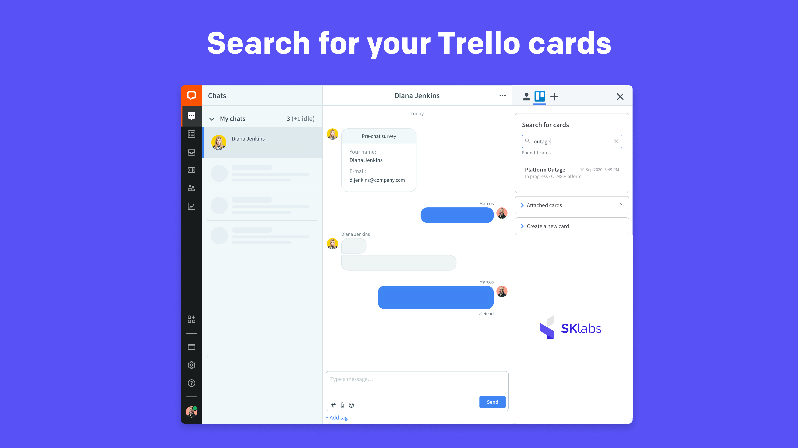
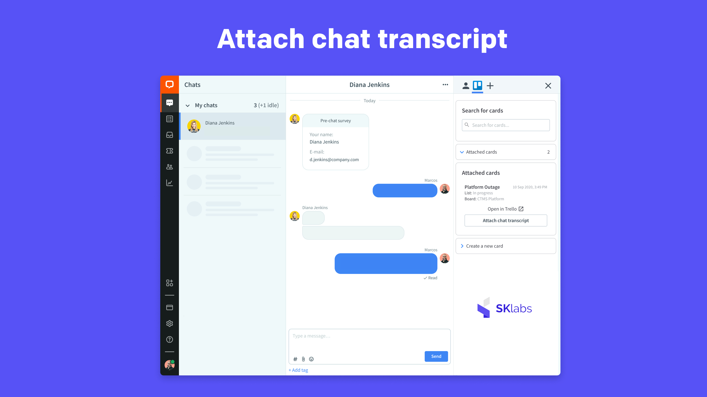
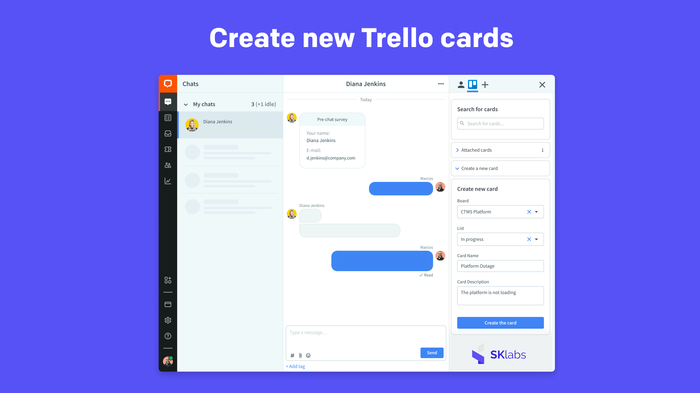

# Trello for LiveChat

## Initial setup

1. Install the app from the LiveChat Marketplace.
2. Log in to the Trello account you'd like to integrate with LiveChat.
3. Authorize Trello for LiveChat by clicking **Allow**.

## Searching cards

You can search for cards that already exist on your Trello board. To do that, start typing the search phrase.
For each card, the app displays the card name, its creation date, as well as the list and the board the card belongs to.

## Viewing attached cards

As an agent, you have access to the cards assigned to the chat customer. You can find them in the **Attached cards** section. View them in the Agent Application or open them in Trello with just one click.

## Attaching chat transcript

Attach chat transcripts to the card assigned to your user account. To do that, go to **Attached cards** and click **Attach chat transcript**.

You can also attach chat transcripts to the cards that are unassigned. To achieve that, search for a card, select it, and click **Attach chat transcript**. By doing that, the card will be automatically assigned to your user account.

## Creating new cards

Go to **Create a new card** and fill out the short form. Select the board and the list on which you want to create the card. Give it a name and description, and confirm the operation by clicking **Create the card**.

## Feedback and feature request

You can send us your feedback and feature request at [hey@sklabs.dev](mailto:hey@sklabs.dev).
